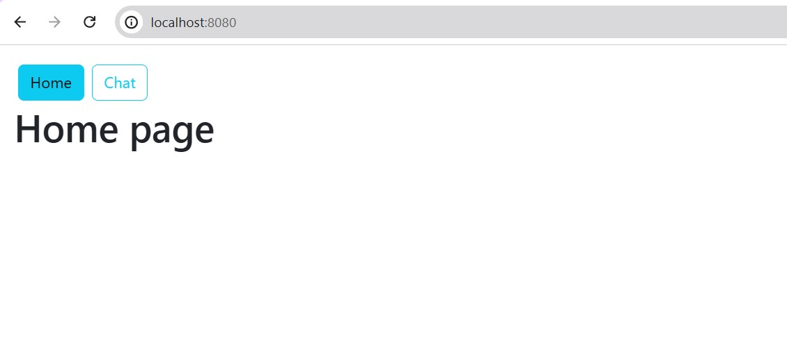

<h2>Compte rendu de l'atelier pratique n'5</h2>
<h3>Titre : Développement d'un Chat Boot RAG Spring React</h3>
<h2>Objectifs :</h2>

Développer une application web fullstack Spring React qui permet mettre en oeuvre un Chat Bot Basé sur un système RAG avec les LLMs llama3 et openAI. L'application utilise Spring AI coté backend et React coté Frontend en utilisant VAADIN.

<h3>ÉTAPE 1</h3>

Crée une application full stack basée sur spring AI et React qui permet de chatter avec un LLM Open AI et Llama

Dans notre cas utilisation de ollama avec le model llama3

Page d'accueil

Page de chat

 

<h3>ÉTAPE 2</h3>

Mettre en place un Vector store (Simple Vector Store) permettant de vectoriser des documents PDF en utilisant un modèle Embeeding (Llama3)

Utilisation du cv personnel : question 1

  

Utilisation du cv personnel : la question posée en francais combine prénom et nom. donc on va la poser en anglais pour eviter la confusion

  

Utilisation du cv personnel : Sous format json

  

Utilisation du cv personnel : question hors context il enverra un message défini par defaut

  

<h3>ÉTAPE 3</h3>

 Développer le Chatbot en exploitant le système Retrieval Augmented Generation

Cette étape consiste à rechercher des informations pertinentes à partir d'une base de données, d'un ensemble de documents, ou d'autres sources de connaissances

Dans notre cas on utilisera encore le cv et on lui posera des questions assez complexes avec une base de données postgres docker

Execution de docker

Creation de la base de données avec la table vector_store

Creation de la base de données avec la table vector_store

<h3>ÉTAPE 4</h3>

Migrer le vectore store vers Pg Vector Store

Migration et stockage des données dans la base de données

<h3>ÉTAPE 5</h3>

Ajouter d'autres Fonctionnalités supplémentaires au projet

Creation d'une page permettant la création et le stockage dans une base de données de personnes

Table person

Ajout d'une nouvelle personne

Fonctionnalité de recherche

<h3>FIN</h3>